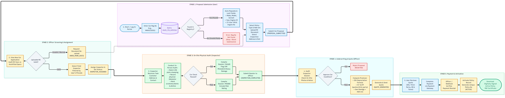

# Automobile Insurance System

A role-based Automobile Insurance Management Platform designed to streamline car insurance proposals, vehicle identity verification via RTO registries, physical on-site vehicle audits, automated quote underwriting, and policy lifecycle tracking

## System Actors & Roles

- **Customer (Applicant):** Enters the vehicle registration number for automated registry retrieval, reviews coverage options, uploads RC documentation, schedules on-site inspection slots, and settles policy premiums.
- **Insurance Officer:** Screens incoming car proposals, assigns designated field inspectors based on location/pincode, audits physical verification dossiers, computes premium quotes (IDV, CC-based Third-Party base, OD), and activates policies upon payment verification.
- **Car Inspector:** Performs mandatory on-site physical verification (verifies chassis/VIN plate stamping, records physical odometer reading, documents dents/scratches, captures live photos), and submits the inspection dossier directly to the Officer.

##  End-to-End Operational Workflow

The system enforces an automated lookup pipeline followed by an officer-controlled inspector assignment and underwriting workflow:

### Key Workflow Highlights
1. **Automated Registration Autofill:** Customer inputs the registration plate; system queries `rto_vehicles` to lock vehicle specifications (Make, Model, Year, Engine CC, VIN) and prevent manual entry errors.
2. **Document & Eligibility Screening:** Officer validates uploaded RC credentials before delegating tasks.
3. **Physical Inspection Audit:** Inspector matches physical stamped numbers on the car against submitted data to eliminate fraud.
4. **Transparent Underwriting:** Premium calculates statutory Third-Party slabs based on engine cubic capacity (CC) plus Own Damage and optional add-on covers.
5. **Instant Policy Issuance:** Active digital policy certificate becomes available immediately after verified payment.
